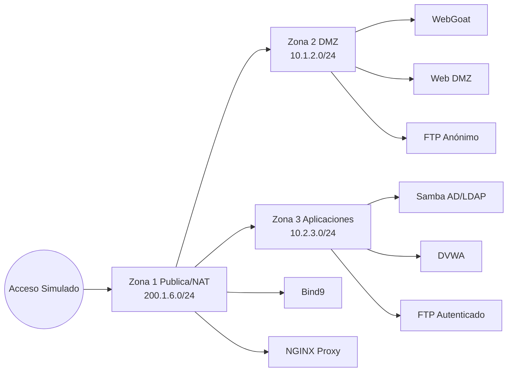

# Topología Propuesta — Equipo A

## Segmentación IP (alcance)

- **Zona 1 — Pública/NAT:** `200.1.6.0/24`
- **Zona 2 — DMZ:** `10.1.2.0/24`
- **Zona 3 — Aplicaciones:** `10.2.3.0/24`

## Servicios por zona

- **Zona 1:** DNS (Bind9), Proxy (NGINX), Router/FW perimetral (NAT + ACL)
- **Zona 2:** WebGoat (servicio vulnerable principal), servidor web DMZ, FTP anónimo
- **Zona 3:** AD/LDAP (Samba DC), DVWA, FTP autenticado

## Diagrama lógico (alto nivel)

## Reglas de diseño

1. Segmentación estricta por zona (mínimo privilegio).
2. Exposición controlada desde Zona 1 hacia DMZ.
3. Zona 3 no expuesta directamente al exterior.
4. Trazabilidad completa de cambios y validaciones por sprint.
